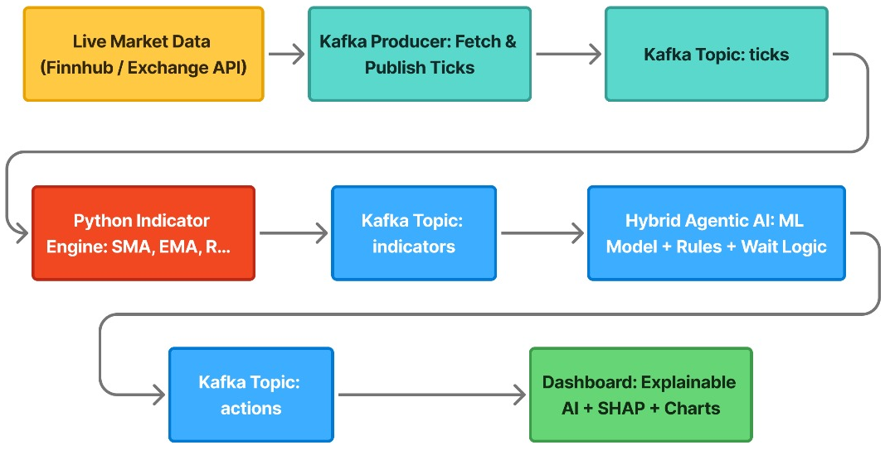
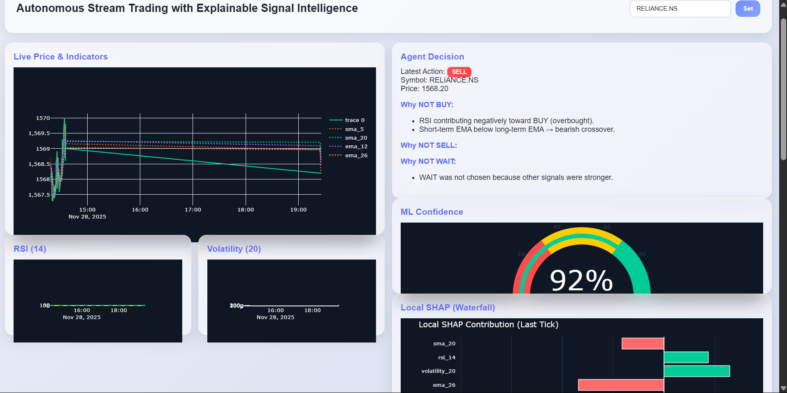
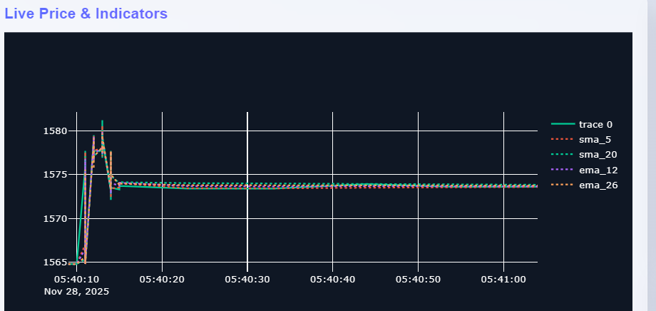
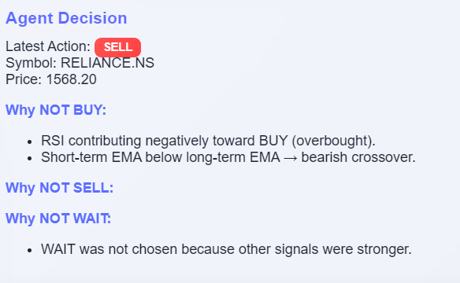
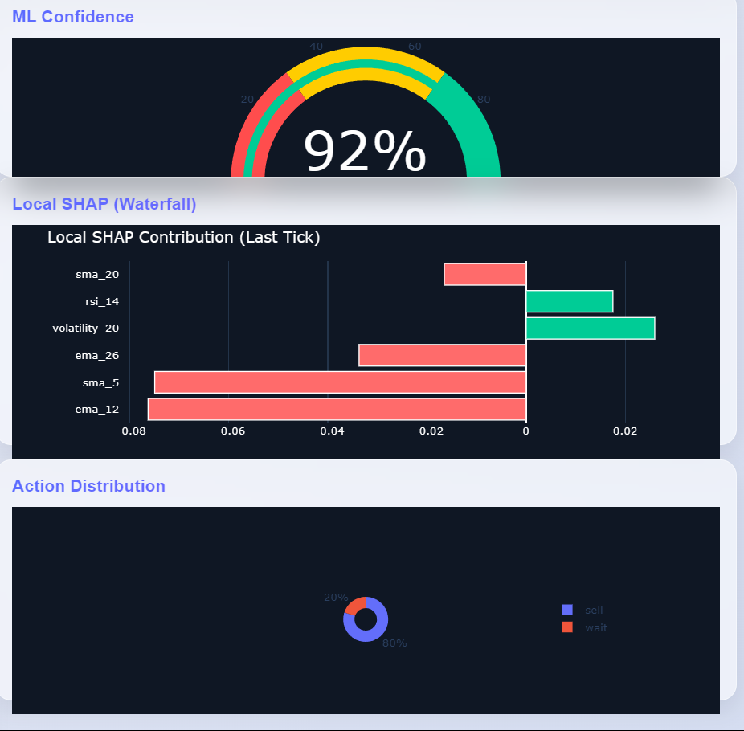

# Autonomous Stream Trading with Explainable AI

## Core Concepts

### Streaming Systems  
Streaming systems handle data continuously as it arrives, allowing real-time processing, instant updates, and immediate responses to changing information. This approach is essential when decisions must be made dynamically rather than through batch processing.

### Agent-Based AI  
Agent-based AI refers to autonomous decision-making entities that observe data, interpret patterns, and take appropriate actions. These agents combine logic and learning to operate independently and intelligently within their environment.

### Explainable AI (XAI)  
**Explainable AI provides clarity on how and why an AI system makes decisions. By revealing the contribution of different inputs and model behaviors, XAI improves transparency, trust, and interpretability, making complex AI outputs understandable to users.
**

---

The proposed system is an autonomous real-time trading platform built on a streaming architecture where live market prices are continuously ingested and transformed into technical indicators such as SMA, EMA, RSI, and Volatility through a dedicated indicator engine. These enriched indicator streams are consumed by a hybrid decision-making agent that combines a trained Random Forest machine-learning model with rule-based logic to evaluate market momentum and trend behavior, ultimately producing BUY, SELL, or WAIT actions. To ensure transparency and interpretability, the system integrates an Explainable AI (XAI) layer using SHAP values, which reveals how each indicator contributed to the agent’s final decision and provides human-readable reasoning for every action the system takes.

---

## Key Features

- **Real-time data ingestion** using Kafka producers  
- **Streaming indicator engine** computing RSI, SMA, EMA, Volatility  
- **ML-powered hybrid trading agent** using Random Forest  
- **Explainable AI** (SHAP values) for decisions  
- **Interactive dashboard** showing:
  - Live prices
  - Indicators
  - Agent decision
  - Why BUY / SELL / WAIT explanation  
- **Docker-based microservice orchestration**

---

## System Architecture

The platform is divided into 5 major components:

1. **Producer**  
   Fetches live market price every second and pushes it to Kafka topic `price_stream`.

2. **Indicator Engine**  
   Consumes live prices → computes technical indicators → sends to `indicator_stream`.

3. **ML Agent**  
   Loads trained Random Forest model → predicts BUY / SELL / WAIT and uses single rule based decision agent and generates explanations.

4. **Dashboard (Dash/Plotly)**  
   Real-time dashboard displaying price, indicators, and ML agent output.

5. **Model Training Module**  
   Offline training script that generates `model.pkl`.

---

# Hybrid Trading Decision Agent

An autonomous trading agent that makes real-time BUY/SELL/HOLD/WAIT decisions using a **Hybrid Rule + Machine Learning (Random Forest)** approach.

## 🔹 Features
- Real-time decision-making (Kafka streaming)
- Hybrid logic: EMA, SMA, RSI, Volatility + Random Forest
- Safe WAIT mode for high-risk conditions (conflict, volatility, sideways, ML uncertainty)
- Explainable decisions (XAI): reasons, ML probability, rule signals
- Dynamic position sizing based on confidence
- Tracks cash, position, entry price, P/L

## 🔹 Indicators Used
- **EMA 12/26** – trend crossover (buy/sell)
- **SMA 5/20** – trend + sideways detection
- **RSI 14** – overbought/oversold momentum
- **Volatility 20** – risk & instability filter

## 🔹 ML Model
- Random Forest classifier  
- Features: SMA5, SMA20, EMA12, EMA26, RSI14, Volatility20  
- Outputs: trend label + confidence

## 🔹 Decision Flow
1. Read indicators from Kafka  
2. Apply rule-based signals  
3. Run ML prediction  
4. Check conflicts, volatility, sideways  
5. Final decision → BUY/SELL/HOLD/WAIT  
6. Send result to Kafka dashboard  

## 🔹 Why Hybrid?
- Rules provide stability  
- ML captures non-linear patterns  
- WAIT logic prevents false trades  
- XAI ensures transparency  

---

# System Visuals & UI Showcase

This section presents all project images in one clean, organized gallery, making the documentation visually appealing and easy to understand.

---

## Architecture Diagram

   

---

## Dashboard Overview

  

---

## Live Price & Indicators

  

---

## Agent Decision Panel

  

---

## ML Confidence Gauge

  

---

## SHAP Explainability (Local Waterfall)

  

---

## RSI & Volatility Panels

  

---

## Recent Actions Log

  

---

# HOW TO RUN THIS PROJECT ON YOUR LAPTOP  
**(Using Your Exact Commands — Windows + PowerShell)**

This is the official way to run your entire system.

---

# Training the Model
**open terminal:**
cd ml_training
python train_model.py

This outputs:model.pkl

**Copy this to:** agent/model.pkl

---

# **STEP 1 — Start Kafka & Zookeeper**

Open Terminal (VS Code or PowerShell): docker-compose up -d

This starts:

- Zookeeper  
- Kafka Broker  

---

# STEP 2 — Start Producer (Terminal 1)

- $env:FINNHUB_API_KEY="API_KEY_REPLACE_WITH_YOURS"
- $env:SYMBOL="RELIANCE.NS"
- $env:KAFKA_BOOTSTRAP="localhost:9092"
- .\venv\Scripts\Activate.ps1
- python producer/producer.py

---

# STEP 3 — Start Indicator Consumer (Terminal 2)

- $env:KAFKA_BOOTSTRAP="localhost:9092"
- $env:KAFKA_TICKS_TOPIC="ticks"
- $env:KAFKA_IND_TOPIC="indicators"
- $env:SYMBOL="RELIANCE.NS"
- .\venv\Scripts\Activate.ps1
- python indicator/consumer_indicator.py

---

# **STEP 4 — Start ML Agent (Terminal 3)**
- $env:KAFKA_BOOTSTRAP="localhost:9092"
- $env:IND_TOPIC="indicators"
- $env:SYMBOL="RELIANCE.NS"
- .\venv\Scripts\Activate.ps1
- python agent/agent.py
---

# **STEP 5 — Start Dashboard (Terminal 4)**
- .\venv\Scripts\Activate.ps1
- cd dashboard
- python app.py

Dashboard will open at: http://localhost:8050

---

# How the Pipeline Flows

Producer → Kafka (ticks) → Indicator Engine → Kafka (indicators) → ML Agent → Kafka (actions) → Dashboard

Real-time decisions:

✔ BUY  
✔ SELL  
✔ WAIT (used during conflict or ML uncertainty)

---

# Explainability (XAI)

**The agent provides:**
- Indicator contributions  
- SHAP values  
- Reasons like:

  - “RSI negatively pushing BUY (overbought)”  
  - “SMA cross-over supports BUY”  
  - “Volatility high → wait”

